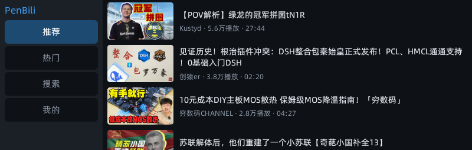
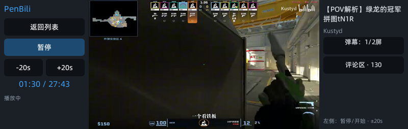
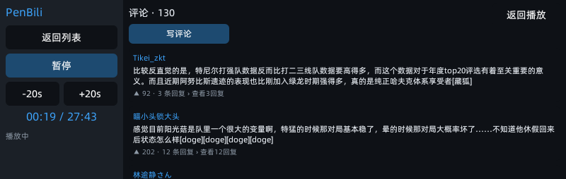

# PenBili

**有道词典笔 X5 上的哔哩哔哩播放器**（Falcon / QuickJS mini-app，Vue 2 SFC）。

在一支词典笔的 800×254 屏上实现：个性化推荐流播放、DASH 双流（画质阶梯 + AAC 音轨）、
蓝牙耳机音频优化、**烧进视频帧的零闪烁弹幕（四档密度）**、评论浏览/发表、TV 协议扫码登录
（登录态持久化）、视频搜索、播放历史。


## 截图

**主页（推荐流）**



**播放中（弹幕烧进视频帧）**



**评论区**



## 功能

- **播放**：DASH 分离流（视频 avc1 + 独立音轨）、按真实宽高信箱适配（竖屏/宽银幕不变形不越列）、±20s seek、播放历史
- **音频**：独立解码进程 + 512KB 抗断环 + 线程优先级调度，蓝牙耳机（A2DP）长视频稳定播放
- **弹幕**：`x/v2/dm/web/seg.so` protobuf 真实弹幕（6 分钟分包、空段续拉、去重），
  **烧进视频帧滚动显示**（与显示层不同源争抢 → 无闪烁）；四档密度（关 / 1/4 屏 / 1/2 屏 / 全屏，
  按钮循环、默认 1/2、偏好持久化跨会话沿用）；接口异常时按钮直接显示「接口错误」并支持点击重试
- **评论**：分页浏览、卡片展示、行内子回复（首屏 4 条、点「更多回复」每次 +4）、
  系统输入法发表评论（csrf 链），评论面板打开时交出显示权（音频不断、画面不闪）
- **登录**：TV 协议扫码（appkey 签名）、cookie 四件套持久化、个性化解锁、过期自检与刷新
- **其它**：推荐 / 热门 / 关键词搜索（WBI 签名）、未登录提示文案、`<hole>` 视频洞布局

## 支持设备

| 项目 | 值 |
| --- | --- |
| 机型 | 有道词典笔 X5（YDPX5-1 / Cvitek CV1826） |
| 固件 | appVersion 3.4.6（`youdao-x5-fw3.4.6`） |
| 运行时 | Falcon mini-app / QuickJS 20200705 |
| 屏幕 | 逻辑 800×254，物理 254×800（direction=270） |

完整设备画像、能力边界与排查史料见 [`profiles/youdao-x5.md`](profiles/youdao-x5.md)。
换机型 / 换固件前请先建立新 profile，不要复用本仓库的几何与工具链结论。

## 目录结构

```text
PenBili/
  package.json            # appid、版本、构建脚本
  src/                    # Vue2 页面与 services（storage/net/input/bili 适配）
  native/csrc/            # 自定义 JSAPI 源码（player.c 播放器、httpjson.c 原生 HTTP）
  libs/                   # 交叉编译产物 *.so（随包分发；可用 native/build.ps1 重建）
  api-mock/fixtures/      # 协议样本（回复/弹幕 protobuf 等，采自公开接口）
  test/                   # 81 + 21 条纯逻辑/协议/几何回归测试
  tools/                  # 部署、图标、诊断脚本
  profiles/youdao-x5.md   # 设备 profile（含排查证据链）
  PenBili.amr             # 可直接安装的成品包
```

## 构建

前置：Node 18+（v24 验证）、有道小程序打包器 **aiot-vue-cli**（1.0.32 验证），
交叉编译 native 另需 **zig**（`arm-linux-gnueabihf.2.23` target）。

```bash
npm ci                 # 前端依赖
npm test               # 81 条回归测试
node test/qr_login_test.js   # 21 条登录协议测试

# 打包 AMR（QuickJS 生产包）
aiot-vue-cli -q -p
# 本仓库脚本等价写法（打包器位于仓库外时）：
#   node ../env/node_modules/aiot-vue-cli/src/cli.js -q -p
#   或设置好 aiot-vue-cli 的 bin 后 npm run build

# 重建 native（可选；libs/ 已带验证过的产物）
$env:ZIG_EXE = 'C:\path\to\zig.exe'; npm run native
```

## 安装

命令以设备 `miniapp_cli --help` 为准：

```bash
adb push PenBili.amr /tmp/PenBili.amr
adb shell miniapp_cli install /tmp/PenBili.amr
adb shell miniapp_cli start 8002026091900004 --index
```

本地开发部署（安装 + 自检 + 截图证据）：`npm run deploy`（`tools/deploy.ps1`，
adb 定位顺序：`$env:BILI_ADB` → PATH → 本机 `../env/adb` 布局）。

## 实现说明（节选）

- **弹幕为什么烧进视频帧**：设备显示链中视频矩形像素由 fb blit 独占（双缓冲 33ms 写入），
  任何同区域 UI 叠层都会与其交替抢帧（真机三现象钉死）→ 弹幕交给 ffmpeg `drawtext`
  在 `transpose` 之前渲染，与视频同源、零争抢。详情见 profile 的平台级发现章节。
- **宽比例视频几何**：信箱适配必须以**视频列 452×254** 为 box（全屏 box 会让 21:9 算出
  越列矩形溢出到两栏），`test/run.js` 含七档比例的越列回归防护。
- **二进制下载**：jsapi http 无法保字节 → native `httpjson.getBinary`（curl GET + ArrayBuffer）。

## 致谢

- [SocialSisterYi/bilibili-API-collect](https://github.com/SocialSisterYi/bilibili-API-collect)：
  B 站接口文档。
- 有道 X5 社区既有项目（deepseek-x5 / video_player_x5 等）的 profile 与工具链经验。  
- DeepSeek Harness：本项目的开发环境与 Agent 工具链。
- DeepSeek v4.1flash、小米 MiMo-v2.6-flash：本项目的代码协作与排障模型。

## 免责声明

- 本项目为个人学习用途，与哔哩哔哩、有道（网易）均无关联；B 站相关商标归其权利人所有。
- `native/iot-miniapp-sdk/include` 为有道小程序官方 SDK 头文件，仅作为本项目
  native 模块的编译依赖随仓库分发，版权归属其原权利人，不适用于本仓库的 GPL-3.0 授权。
- 使用本软件访问服务时请遵守哔哩哔哩用户协议；账号安全责任自负。
- **无任何担保**；详见 LICENSE。

## 许可证

[GPL-3.0](LICENSE)（GNU General Public License v3.0）
