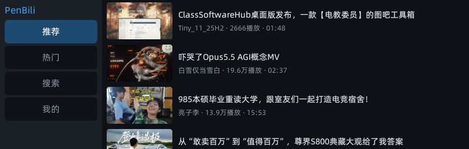
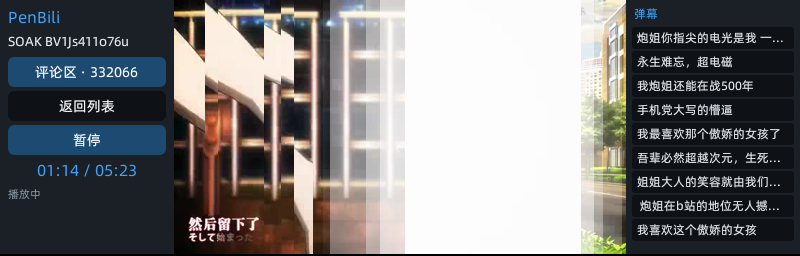
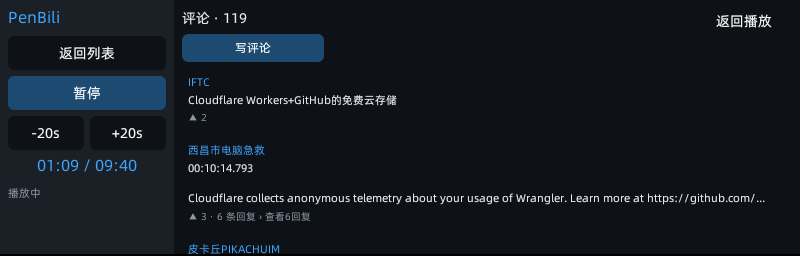

# PenBili

**有道词典笔 X5 上的哔哩哔哩播放器**（Falcon / QuickJS mini-app，Vue 2 SFC）。本发布以仓库 `v2.7.0` 源码为基线，当前版本号为 `2.9.4`。

在逻辑分辨率 800×254 的设备屏幕上提供推荐流、DASH 播放、视频/图文/直播三栏搜索、图文阅读、评论浏览/发表、TV 协议扫码登录与播放历史。
弹幕已于 v2.7.0 移除，以避免弱设备上的逐帧文字渲染拖慢视频解码。

> **`2.9.0` 变更**：**直播间播放上线** —— 搜索三栏的「直播」由占位转为可用：直播间经**服务端转码**取 360/480/540p 流（服务端以 **HLS 分片**回传，笔端当点播地址播放）；「我的 → 直播设置」配置转码服务器地址与起播缓冲，并带**重定向解析缓存**（外网端口每次打洞都会变，启动时 2s 探测、失效自动重解析）。
> **`2.9.1` 变更**：**修掉搜索偶发「B站 code=?：WBI 密钥获取失败」** —— 根因是笔端 HTTP 栈偶发 DNS 解析超时（真机 `YHttpManager` 日志 `Resolving timed out after 6000 milliseconds`，连系统自有域名一起偶发），`nav` 取签名密钥被殃及。改为**短退避重试 3 趟（jsapi → native libcurl → jsapi）+ 双栈兜底**，单趟超时收敛到 7s；同时把真实失败原因（stage/code）透传到界面，不再只显示 `code=?`。新增 `wbiStress` 诊断种子与 5 条单测（107 条全绿）。
> **`2.9.2` 变更**：**修掉直播卡顿/帧率低（~4fps）且无声** —— 根因是 native 播放器的「音频锚节流」在**单进程音视频**路径（直播）上形成自锁：视频 pipe 上限仅 1MB、音频 writer 要等环形缓冲蓄满 800ms 才开写、而 ffmpeg 同进程产出音视频 → 视频 writer 等音频锚（恒 0，实测 `drift ≡ -frames×33ms`）每帧撞满 200ms 限幅 → ffmpeg 被满 pipe 堵死 → 环永远蓄不满 → **帧率恒 4.2fps 且 aplay 全程无数据（无声）**。改为**直播走墙钟节拍**（`duration_ms<=0`）+ **直播关闭水位滞回**（可闻滞后收敛到管道+ALSA ≈0.56s）+ 墙钟基线对齐首帧、并按音频管道延迟补偿画面。同时把直播默认画质从 480p 改为 **254（= 视口 452×254，1:1 无缩放）**：480p 在本机软解+缩放+转置+rgb32 链上只有 0.83x（必卡），254 有 2.3~2.8x。实测：**4.2fps → 30.0fps**、音频 19.7KB/s → **176KB/s（实时）**、欠载 0、音画偏移稳定 -0.5s（不再漂移）。
> **`2.9.3` 变更**：**给笔端真正加上缓冲，消掉「卡一下→画面突然加快」的循环**。① 笔端的缓冲深度由**两条管道**决定（视频 pipe = 画面延迟、aplay pipe = 声音延迟），而视频 pipe 的 8MB 扩容**一直没生效**（`/proc/sys/fs/pipe-max-size` 默认 1MB 把申请顶回去，程序无 CAP_SYS_RESOURCE）→ 现在启动时先放宽该 sysctl，视频 pipe 实测拿到 **32MB（≈1.5–2s 存量）**，直播同时把 aplay 管道加深到 256KB（≈1.68s）使两侧量级相当；② 墙钟落后时的追赶**限制在 1.25 倍速**（原来是不限速快放，所以观感是「整段突然加快」）；③ 新增**自适应音画对齐伺服**：用实测 avDrift 反向微调画面目标，把这台设备/这套缓冲下的残差压到 **±30ms**（起播约 10s 内收敛）。另：把设置项「起播缓冲」正名为 **「服务端分片窗口」**——它只决定服务端保留多少分片（笔端落后时的抗抖动余量），**并不影响起播时间**（此前命名误导）。
> **`2.9.4` 变更**：**修掉「连续播放 30 分钟后音频落后视频约 1.5 秒」+ 打通外网直播链路**。
> ① **音视频分离双进程**：单进程 ffmpeg 串行写视频/音频两个输出，视频 pipe（32MB 缓冲）被填满时 ffmpeg **整体阻塞** → 音频同停 → 环/管道被抽干 → ALSA underrun（真机实测 8 次、最长 2.36s）→ **音频内容永久落后**（累计 3.17s）。改为视频进程 + 音频进程各自独立拉同一条转码地址，视频背压不再牵连音频产出。
> ② **外网链路修复**（STUN 打洞 + Cloudflare 301 场景）：CF 的 301 规则**会丢弃 query string**（`best/live?room=...` → `xyz:端口/live`，服务端 400）；`jsapi.http` 不跟随 301，重定向解析改走 **native libcurl**（`FOLLOWLOCATION=1`）拿终点 host 回写 `resolvedAddr`，播放直连打洞地址绕过 301；降级（解析失败）不再回写缓存；探测超时 2s/5s → 8s/15s（打洞端口 TCP connect 实测可达 5s+）；直播首帧上限 15s→60s、并禁用断流重启（`-ss` seek 对 HLS 直播滑动窗口无效，会卡死循环）。
> **30 分钟外网长测**（某在播房间，手机热点 + STUN 打洞）：帧率 **29.95fps**、位置增速 **1.00x 实时**、**underrun 0 次**（修复前 8 次累计 3.17s）、丢帧/重启 0；音画偏移 `d` 全程稳定，仅 19.7 分钟处一次外网抖动导致音频进程短暂断供 ~2s（偏移最深 -2232ms），**伺服 30s 内自愈到 -40ms，无永久落后**（修复前会永久落后 1.5s）。


## 截图

**主页（推荐流）**



**播放中**



**评论区**



以上为 `2.7.1` 在真机 有道 X5 上的实测截图（`2.8.0` 新增的搜索分栏与图文页面截图待补），可自行用 `npm run deploy` 重新采集。

## 功能

- **播放**：DASH 分离视频与 AAC 音轨，当前请求 360p（id16）并优先选择 AVC；必要时回退单文件流；按视频实际宽高信箱适配，支持 ±20 秒定位与播放历史。
- **音画同步**：轻微漂移时平滑追赶；音频领先超过 1 秒时只重启视频流并重新对齐，音频不中断；首帧等待有 15 秒上限，失败后自动恢复。
- **网络抖动缓冲**：FFmpeg 输入线程预取压缩数据包（视频队列 300、音频队列 700）；它不是解码后的视频帧缓存，也不保证所有网络条件下固定 15 秒可用缓冲。
- **音频**：独立解码进程与音频环形缓冲，支持设备默认输出和 A2DP 音频路由。
- **评论**：分页浏览、子回复、系统输入法发表评论；评论面板打开时维持音频播放并避免视频闪烁；评论类型参数化（视频=1、专栏图文=12）。
- **搜索**：关键词搜索，结果分「视频 / 图文 / 直播」三栏，各自独立缓存与分页。
- **直播播放**：搜索直播间 → 经服务端转码取流（`/live?room=N`，笔端登录 cookie 由服务端代为拉 720p 源，避免未登录风控）；服务端以 **HLS（1s 分片、滑动窗口）**回传，笔端 ffmpeg 的 hls demuxer 当普通点播地址消费，`durationMs=0` → 不判播完、不提供定位。**输出高度默认 254**（= 视口 452×254，与屏 1:1 → 笔端缩放被跳过，2.3~2.8x 余量）；480p 会被笔端缩回 452×254 却只剩 0.83x（必卡），故不再作推荐档。
- **图文阅读**：专栏详情以文本/图片混排块渲染（opus 结构化段落优先，content HTML 兜底）；正文按块级标签分段（每段独立成块），段内 `<br>` 视为软换行；`/x/article/view` 需 WBI 签名，走 native libcurl 传输并携带完整浏览器头（瘦请求头会被风控判 -352）；图片按原始比例等比渲染。
- **登录**：TV 协议扫码登录、登录态持久化、过期检查与刷新。

## 设备与兼容性

| 项目 | 值 |
| --- | --- |
| 机型 | 有道词典笔 X5 |
| 运行时 | Falcon mini-app / QuickJS 20200705 |
| 逻辑屏幕 | 800×254 |
| 视频区域 | 452×254，按源视频宽高信箱适配 |

设备画像、诊断日志、运行截图及本地环境信息不随此版本分发。更换设备或固件时应重新验证屏幕几何与解码能力。

**直播需要一台转码服务器**（本仓库 `server/live_proxy.py`，v5 / HLS）：在笔端「我的 → 直播设置」填写其地址；未填写时点播直播会提示「未填写转码服务器地址，无法播放」。

## 性能诊断记录

一次约 4.5 分钟的播放采样（253 个样本）中，播放稳定期未观察到超过 1 秒的停帧；超过 1 秒的停顿出现在流启动或首帧恢复阶段。该轮中视频解码约占单核 55–81%，应用进程约 5%，全机约 25%。这说明该样本中的停顿更像首帧/流启动等待，而非持续的解码饱和；不同视频和网络下结果可能不同。

`2.7.1` 真机自检（有道 X5，DASH 360p / AVC）实测：首帧约 1.1 秒；稳定播放期音画漂移 2–36 ms、重同步 0 次、缓冲约 0.56 秒；±20 秒定位后约 1.5 秒恢复出帧。音频首帧会等待视频首帧后同步开播，避免起播瞬间的唇音错位。该数据仍适用于 `2.9.4`（点播 DASH 本就是双进程，本轮只改直播链路，点播未动）。

`2.9.4` 外网直播 30 分钟长测（手机热点 + STUN 打洞 + CF 301，某在播房间，服务端 res=254）：
帧率 29.95fps、位置 1.00x 实时、underrun 0 次、丢帧/重启 0、音画偏移 `d` 全程稳定在 ±100ms（除 19.7 分钟一次外网抖动致音频进程短暂断供 ~2s、偏移 -2232ms，伺服 30s 内自愈）。
对照：修复前（单进程）30 分钟后音频永久落后 1.5s、underrun 8 次累计 3.17s。

`2.9.0` 直播实测（笔端直连服务端内网 2050，在播房间）：笔端 ffmpeg 拉 HLS 12 秒解出 360 帧（恰好 30fps、零丢帧），起播阶段大于 2 倍速、稳态 1.23 倍速；服务端侧 ffmpeg 播同一条 m3u8 12 秒零告警。

`2.9.2` 直播实测（同上房间，服务端 res=254）：修复前 **4.2fps**（`frames` 每 5s 仅 +21、播放位置每 5s 只走 700ms ≈ 0.14x、音频仅 19.7KB/s、aplay 零消耗）；修复后 **30.0fps**（每 5s +150 帧、位置 1000ms/s）、音频 **176KB/s 实时**、欠载/丢包 0、`avDrift` 稳定 −0.5s。服务端分片 452×254@30fps + aac 44100。

## 构建与测试

前置：Node.js 18+、有道小程序打包器 **aiot-vue-cli**（1.0.32 验证）；重建 native 库另需 Zig（`arm-linux-gnueabihf.2.23` target）。

```bash
npm ci
npm test                    # 107 条逻辑、协议与几何回归测试（含图文正文解析、直播地址/画质档与重定向缓存）
node test/qr_login_test.js  # 21 条登录协议测试

# 打包 AMR（QuickJS 生产包）
npm run build

# 可选：从 native 源码重建库
# PowerShell: $env:ZIG_EXE = 'C:\path\to\zig.exe'; npm run native
```

## 安装与真机自检

具体命令以设备上的 `miniapp_cli --help` 为准：

```bash
adb push PenBili.amr /tmp/PenBili.amr
adb shell miniapp_cli install /tmp/PenBili.amr
adb shell miniapp_cli start 8002026091900004 index   # 页面名**不带** `--`；写成 `--index` 会报 could not load module filename '--index.js'
```

本地部署、自检与截图采集：`npm run deploy`（依赖 ADB 可访问设备）。

## 隐私与仓库内容

- `profiles/` 下的设备资料、真机日志和截图为本地文件，不应提交。
- 登录与搜索样例使用脱敏或占位数据；不要提交账号 Cookie、二维码登录数据、设备序列号、MAC 地址、内网地址或签名播放 URL。
- `.gitignore` 已排除 `profiles/`、部署状态及构建中间文件。

## 致谢

- [SocialSisterYi/bilibili-API-collect](https://github.com/SocialSisterYi/bilibili-API-collect)：B 站接口文档。
- 腾讯 **WorkBuddy**：开发环境与 Agent 工具链。
- **GLM-5.3-Flash**（智谱）、DeepSeek 与小米 MiMo：代码协作与排障。

## 免责声明

- 本项目为个人学习用途，与哔哩哔哩、有道（网易）均无关联；相关商标归其权利人所有。
- `native/iot-miniapp-sdk/include` 为有道小程序官方 SDK 头文件，仅作为 native 模块的编译依赖随仓库分发；版权归原权利人，不适用于本仓库 GPL-3.0 授权。
- 使用本软件访问服务时请遵守哔哩哔哩用户协议；账号安全责任自负。
- **无任何担保**；详见 LICENSE。

## 许可证

[GPL-3.0](LICENSE)（GNU General Public License v3.0）
